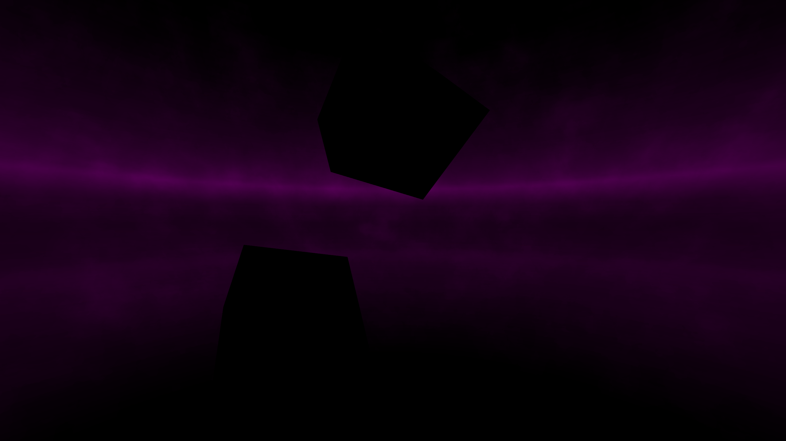

# Info

### My Vocab
Anytime I mention "env pieces" I'm referring to game objects that are loaded in when a level is loaded, which can be affected with Environment Enhancement. 

Anytime I mention "directional lights" I'm referring to the `DirectionalLight` game objects in the env. For example, on Billie there are `DirectionalLightFront`, `DirectionalLightBack`, `DirectionalLightLeft`, and `DirectionalLightRight` under `DayAndNight/Day` and `DayAndNight/Night`

### Details
All screenshots use the Billie environment with all of the env pieces being removed, except for `BigSmokePS`, to show whether or not the material will be "corrupted" on the envs that do that to geo. (See ["Corruption"](README.md#corruption))

If a screenshot has any other env pieces/geo/game objects, it was done to show a certain type of effect that the material will have. For example, some shader keywords will cause any smoke to not be visible from behind the geo. In these cases, I likely threw in the `Clouds` env piece or something else to better demonstrate that.

All screenshots have the environment fog unchanged from the default values unless specified otherwise. 

All screenshots have the geo and env rotated a bit to show how a material will react to directional lights. 

In any screenshots with the background colored, every light for the env was set to either red or blue and the lights for geo were set to green to show how the lightmaps/reflection probes would affect the material.

All code snippets will use `map` as the output. Here's an example of that, with `ExpertPlusLawless.dat` being the input and `ExpertPlusStandard.dat` being the output:
```typescript
const map = new Difficulty("ExpertPlusLawless.dat", "ExpertPlusStandard.dat");
```
You can change it to whatever you want but the `map` in the material code will have to match whatever you chose for your output difficulty.

If a material does not have `color` set, then it cannot be colored by the material. However, it still could be colored by: the lightmap, directional lights, or by lighting the geo itself, if supported.

### "Corruption"
The environments I know of currently that "corrupt" some materials are Billie, Interscope, and Linkin.

I believe the corruption is caused by the light maps in some materials, as removing the lightmap or changing lightmaps fixes this problem. I could be wrong on this though.

These materials will be corrupted if these environments are in use, or even loaded *before* playing the map even if the environment you use is not one of them. So, it is best to not use them.

Example of what I'm calling "corrupted": 
```typescript
map.geoMaterials["DefaultConcrete"] = {
  shader: "InterscopeConcrete",
  color: [1,1,1,1]
}
```
[Corrupted Example Image](https://github.com/Shonshyn/BS-Tools-for-Mappers/blob/main/Geo%20Materials/corrupted%20example1.png) 

# Material List 
[Lightable Shaders](README.md#the-three-light-able-materials-that-i-know-of)

[Fixed Concrete](README.md#fixed-concrete-material)

[Dirt/Wood/Stone](README.md#dirt-material)

[Crystal/Glass](README.md#crystalglass-material)

[Fog Light](README.md#fog-light-material)

[Grid](README.md#grid-material)

[Invisible](README.md#invisible-material)


## The Three Light-able Materials (that I know of)
Everybody knows about `TransparentLight` and `OpaqueLight`, but not a lot of people know that `BillieWater` contains all the necessary stuff to act as a light, and can be lit with the right shader keywords (or lack thereof).
A lot of people also don't know that the three shaders also look different from one another when lit.
All geo in the first three screenshots has `bloomFogIntensityMultiplier` set to zero, with the last having bloom untouched.

Unlit:

Lit:

Lit, but lights are set to [0,0,0,0]:

Lit with bloom:


Material on the left:
```typescript
map.geoMaterials["DefaultOL"] = {
  shader: "OpaqueLight"
}
```

Material on the right:
```typescript
map.geoMaterials["DefaultTL"] = {
  shader: "TransparentLight"
}
```

Material on the top:
```typescript
map.geoMaterials["GlowlessLight"] = {
  shader: "BillieWater",
  shaderKeywords: []
}
```

## Fixed Concrete Material
I tried to match the default `InterscopeConcrete` shader as much as possible, but I removed the lightmap to fix the "corruption". ~~This way of doing it also removes the ability to color the material, but I might try to find a way to fix that later.~~ Added `"DIFFUSE"` to the "FixedConcrete" material which allows it to be colored again. :)

Comparison:


Material on the left:
```typescript
map.geoMaterials["DefaultConcrete"] = {
  shader: "InterscopeConcrete",
  color: [0, 1, 0, 1]
}
```

Material on the right:
```typescript
map.geoMaterials["FixedConcrete"] = {
  shader: "InterscopeConcrete",
  color: [0, 1, 0, 1],
  shaderKeywords: ["DIFFUSE", "DIRT", "ENABLE_DIFFUSE", "ENABLE_DIRT", "ENABLE_DIRT_DETAIL", "ENABLE_FOG", "ENABLE_GROUND_FADE", "ENABLE_SPECULAR", "ENABLE_VERTEXT_COLOR", "FOG", "NOISE_DITHERING", "REFLECTION_PROBE", "REFLECTION_PROBE_BOX_PROJECTION", "REFLECTION_PROBE_BOX_PROJECTION_OFFSET", "_EMISSION", "_ENABLE_FOG_TINT", "_RIMLIGHT_NONE"]
}
```

## Dirt Material
Can also be used for grass, snow, wood, stone, rocks, and really anything that needs texture but doesn't need to be shiny/reflective.
```typescript
map.geoMaterials["DirtMat"] = {
  shader: "InterscopeConcrete",
  color: [0.5, 0.368, 0.36, 1],
  shaderKeywords: ["DIFFUSE", "DIRT", "FOG", "REFLECTION_PROBE_BOX_PROJECTION"]
}
```


## Crystal/Glass Material
```typescript
map.geoMaterials["CrystalMat"] = {
  shader: "TransparentLight",
  shaderKeywords: [
    "REFLECTION_PROBE"
  ]
};
```
Unlit:


Lit:
 

## Fog Light Material
Light dissolves in fog, the bloom from `TubeBloomPrePassLight` component is still visible though. Can also be used without being lit to hide some parts of something in the fog, as nothing behind the geo in the fog will be visible.
```typescript
map.geoMaterials["FogMat"] = {
  shader: "OpaqueLight",
  shaderKeywords: ["ENABLE_HEIGHT_FOG"]
}
```
This screenshot has the fog set to these parameters: 
```typescript
components.BloomFogEnvironment = {
  attenuation: 0,
  offset: 0,
  startY: -0.25,
  height: 0
}
```


## Grid Material
This material always glows for some reason, it could be possible that the glow can be removed but I haven't figured it out.
```typescript
map.geoMaterials["GridMat"] = {
  shader: "WaterfallMirror",
  shaderKeywords: ["ENABLE_DIRT"]
}
```


## Invisible Material
This material is invisible or does not render, or is broken because it doesn't like instancing or something idk. It's a great way to get some collision without using an unlit transparent light.
This effect also works with the `BillieWater` shader, but I assume using that shader would be slightly more expensive.
```typescript
map.geoMaterials["InvisMat"] = {
  shader: "InterscopeConcrete",
  shaderKeywords: ["INSTANCING_ON"]
}
```


